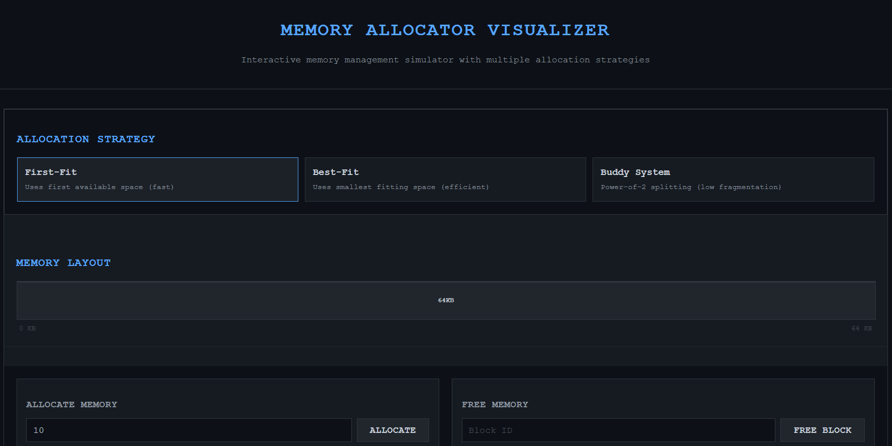

##  C++ Implementation
The original C++ implementation with terminal UI:
[memory-allocator-simulator](https://github.com/khadija1205/memory-allocator-simulator)

Try it- https://memory-allocator-visualizer.vercel.app/

